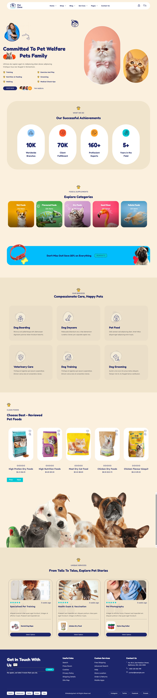

<div align="center">

# Project : Pet Zone Website

**A responsive single-page pet e-commerce & services website built with React. Features an animated hero with organic blob-shaped imagery, auto-sliding product/service carousels (Swiper), an achievements/stats strip, an interactive marching-ants coupon button, and a fully custom design system built without any CSS framework.**

</div>

---

## 📑 Table of Contents

- [Project Description](#-project-description)
- [How This Project is Made](#-how-this-project-is-made)
- [Features](#-features)
- [Technologies Used](#-technologies-used)
- [React Concepts Covered](#-react-concepts-covered)
- [How It Works](#-how-it-works)
- [Project Structure](#-project-structure)
- [Screenshot](#-screenshot)
- [Demo](#-demo)
- [Author](#-author)

---

## 📌 Project Description

Pet Zone is a React-based landing page for a pet food, supplies and services e-commerce brand. It walks a visitor through a welcoming hero section, key business achievements, a browsable food category grid, a promotional discount coupon, a services overview, a swiper of best-reviewed pet food products, a swiper of unique pet care services/stories, and closes with a detailed footer including a newsletter signup and social links.

This project was built to practice component-driven UI development in React from scratch: converting a fully custom, image-heavy design into small, independent components, wiring up carousels with the Swiper library, and building an entire layout system — grid, spacing, buttons, cards — using hand-written custom CSS instead of a framework like Bootstrap or Tailwind.

---

## 🚀 How This Project is Made

This project is built using **React (Vite)**, plain **CSS**, **react-icons** and **Swiper** to recreate a fully custom-designed **Pet E-Commerce & Services Website**.

### 🧱 Component Structure

- The app is composed of small, single-responsibility components (`Navbar`, `Hero`, `Achievements`, `Food`, `Coupon`, `Services`, `CleanFood`, `ServUnique`, `Footer`), all rendered from `App.jsx`.
- The **Navbar** sits in a rounded white pill bar with dropdown menus that reveal on hover, plus cart/wishlist icons with a notification badge.
- The **Hero** section pairs a two-column layout: a circular portrait photo, heading, checklist of services and a CTA button with an overlapping avatar stack on one side, and organic blob-shaped pet photos (achieved with custom `border-radius` values) on the other.
- The **Achievements** section displays key business stats inside a large rounded card, each paired with a colored icon badge.
- The **Food** section shows a categories grid where each card is a two-layer structure (a background-image layer that scales on hover, and a separate text-overlay layer that stays static) so only the photo zooms, not the whole card.
- The **Coupon** section is a colored banner with a custom-drawn SVG "marching ants" animated dashed border around the discount code button, built with `stroke-dasharray` and an animated `stroke-dashoffset`.
- The **Services** section lays out service cards in a responsive grid over a soft background tint.
- The **CleanFood** and **ServUnique** sections each use a **Swiper** carousel — one for best-reviewed pet food products, one for pet care service stories/testimonials — both with responsive `breakpoints` so the number of visible slides adapts from mobile to desktop.
- The **Footer** closes the page with a newsletter signup form, three link columns (Useful Links, Custom Services, Contact Us), a divider, and a bottom row of payment badges, copyright text and pill-shaped social links.

### 🎨 CSS Styling

- A small custom utility layer (`d-flex`, `d-inline-block`, `justify-content-between`, `align-items-center`, `flex-wrap`, a 12-column `col-*` grid with responsive `col-sm-*` / `col-md-*` / `col-lg-*` variants) stands in for a CSS framework, keeping the layout system lightweight and fully understood.
- CSS custom properties (`--text-primary`, `--text-hover`, `--text-desc`, `--bg-secondary`) centralize the site's navy, teal and cream color palette.
- Organic "blob" shapes for the hero's cat photos are achieved with asymmetric `border-radius` percentages rather than image masking, keeping the effect purely in CSS.
- A reusable "zoom the image, not the card" pattern (absolutely-positioned image layer + absolutely-positioned content layer inside an `overflow: hidden` card) is used across the food category cards and product cards.
- A custom animated dashed border (SVG `<rect>` with `stroke-dasharray` + a `stroke-dashoffset` keyframe animation) powers the "marching ants" coupon button effect.
- Swiper's default styling is overridden to match the site's navy/teal palette for navigation arrows and pagination dots.

### ⚙️ React Functionality

- Each section is a self-contained functional component that imports its own images/icons directly via ES module `import`.
- **Swiper** (`swiper/react`) drives both the food product carousel and the unique services carousel, configured with `spaceBetween`, `slidesPerView` and responsive `breakpoints` objects.
- `react-icons` supplies every icon in the project (navigation dropdown carets, cart/wishlist icons, star ratings, social icons, contact icons) instead of custom icon assets.
- Native HTML form elements (`<input type="email">`, `<button>`) handle the newsletter signup, with `onSubmit={(e) => e.preventDefault()}` to prevent a full page reload during development.

---

## ✨ Features

- Rounded, sticky navbar with hover-triggered dropdown menus
- Hero section with organic blob-shaped pet imagery and an overlapping avatar social-proof stack
- Business achievements/stats strip
- Food category grid with hover-zoom images (image zooms independently of card text)
- Promotional discount banner with an animated dashed "marching ants" coupon button
- Services grid over a tinted background section
- Swiper-powered "Best-Reviewed Pet Foods" product carousel
- Swiper-powered "Unique Services" testimonial/story carousel
- Footer with newsletter signup, quick links, contact info, payment badges and social links

---

## 🔧 Technologies Used

- React (Vite)
- JavaScript (ES6+)
- CSS3 (custom utility classes, no framework)
- react-icons
- Swiper (`swiper/react`)

---

## 📚 React Concepts Covered

- Functional components
- Component composition and single-responsibility components
- Props-free, self-contained component data written directly in JSX
- Static asset imports (images, icons) via ES module `import`
- Third-party component libraries (Swiper) with configuration props
- Event handling (`onClick`, `onSubmit`)
- Conditional/utility-driven class names for layout (`d-flex`, `col-*`, etc.)

---

## 🔄 How It Works

### Navbar
- Renders as a white, rounded pill bar with the logo on the left and nav links in the center.
- Each nav item with a dropdown reveals its submenu on `:hover` via a CSS opacity/visibility transition — no JavaScript state involved.

### Hero
- Displays a circular portrait photo, a two-line heading with an inline photo thumbnail, a two-column checklist of services, a CTA button and an overlapping avatar stack.
- The right column shows two organic blob-shaped pet photos layered with decorative arrow/shape SVGs.

### Achievements
- Shows four key stats (branches, client fulfillment, experts, years in the field) inside a large rounded card with colored icon dots.

### Food (Categories)
- Displays five food category cards, each with a background photo that scales up on hover while the overlaid title/item-count text stays fixed in place.

### Coupon
- A colored banner announcing a site-wide discount, with an animated dashed-border button showing the discount code.

### Services
- A responsive grid of service offering cards over a tinted background section.

### CleanFood (Best-Reviewed Pet Foods)
- A Swiper carousel of product cards, each with a photo, wishlist/search icon overlay, star rating and price.

### ServUnique (Unique Services)
- A Swiper carousel of service story cards, each with a photo, star rating, publish date, description, a related product callout and a "Select Options" button.

### Footer
- A four-column layout (newsletter signup, Useful Links, Custom Services, Contact Us) followed by a divider and a bottom row of payment method badges, copyright text and pill-shaped social media links.

---

## 📂 Project Structure

```text
petzone-app/
│
├── src/
│   ├── assets/
│   │   └── images/
│   │       ├── hero/
│   │       ├── achievements/
│   │       ├── food/
│   │       ├── clean/
│   │       ├── unique/
│   │       ├── services/
│   │       └── coupon/
│   │
│   ├── components/
│   │   ├── Navbar.jsx
│   │   ├── Hero.jsx
│   │   ├── Achievements.jsx
│   │   ├── Food.jsx
│   │   ├── Coupon.jsx
│   │   ├── Services.jsx
│   │   ├── CleanFood.jsx
│   │   ├── Photo.jsx
│   │   ├── ServUnique.jsx
│   │   └── Footer.jsx
│   │
│   ├── App.jsx
│   └── index.css
│
├── index.html
├── package.json
└── README.md
```

---

## 📸 Screenshot

### Full Page


---

## 🎬 Demo

| | |
|---|---|
| 🔗 Live Demo | [Pet Zone Website](#) |
| 🎥 Project Walkthrough | [Project Explanation](#) |

---


**Rukaiya Sadikot**

[](https://github.com/yourusername)

⭐ Thank you for visiting this repository!

</div>